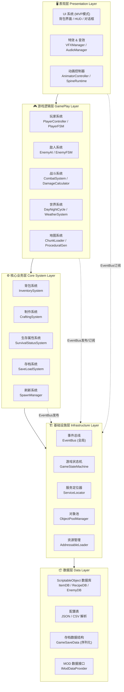

# 2D末世求生游戏 — Unity 底层程序架构设计方案 v1.0

---

## 一、架构总览

架构采用 **五层菱形分层模型**，依赖方向单向向下，跨层通信通过 EventBus 解耦。



### 各层职责说明

| 层级 | 职责 | 不允许做的事 |
|------|------|-------------|
| **数据层** | 存储纯数据定义，无任何逻辑；ItemSO、RecipeSO、存档结构体 | 不得引用任何上层类 |
| **基础设施层** | 提供引擎无关的核心机制；事件总线、状态机、对象池、资源加载 | 不得包含业务逻辑 |
| **核心业务层** | 实现生存游戏独立的核心规则；背包CRUD、制作配方验证、存档序列化 | 不得直接操作UI |
| **游戏逻辑层** | 处理运行时游戏行为；角色FSM、AI决策、战斗计算、世界生成 | 不得直接读写UI控件 |
| **表现层** | 纯粹的视听反馈；UI响应事件更新、动画状态切换、特效播放 | 不得包含任何业务规则 |

---

## 二、项目目录结构

```
Assets/
│
├── _Game/                              # 所有游戏代码，与Unity资源严格隔离
│   │
│   ├── 01_Data/                        # ═══ 数据层 ═══
│   │   ├── ScriptableObjects/
│   │   │   ├── Items/                  # ItemDefinitionSO.cs + 所有.asset文件
│   │   │   │   ├── _Base/
│   │   │   │   │   └── ItemDefinitionSO.cs
│   │   │   │   ├── Consumable/         # 消耗品 (食物、药品)
│   │   │   │   ├── Weapon/             # 武器
│   │   │   │   ├── Tool/               # 工具
│   │   │   │   ├── Material/           # 制作材料
│   │   │   │   └── Equipment/          # 装备
│   │   │   ├── Recipes/                # RecipeDefinitionSO.cs
│   │   │   ├── Enemies/                # EnemyDefinitionSO.cs
│   │   │   ├── SurvivalConfig/         # SurvivalConfigSO.cs (饥饿速率等)
│   │   │   ├── WorldGen/               # 世界生成参数SO
│   │   │   └── Balancing/              # 数值平衡配置SO
│   │   ├── Configs/                    # JSON/CSV外部配置
│   │   │   ├── ItemDatabase.json
│   │   │   └── LocalizationTable.csv
│   │   └── SaveData/                   # 存档相关数据结构(纯C#类，无MonoBehaviour)
│   │       ├── GameSaveData.cs
│   │       ├── PlayerSaveData.cs
│   │       ├── WorldSaveData.cs
│   │       └── InventorySaveData.cs
│   │
│   ├── 02_Infrastructure/              # ═══ 基础设施层 ═══
│   │   ├── EventBus/
│   │   │   ├── EventBus.cs             # 全局事件总线核心
│   │   │   ├── IEvent.cs               # 事件接口标记
│   │   │   └── Events/                 # 所有事件定义(按模块分文件)
│   │   │       ├── InventoryEvents.cs
│   │   │       ├── CombatEvents.cs
│   │   │       ├── SurvivalEvents.cs
│   │   │       ├── WorldEvents.cs
│   │   │       └── UIEvents.cs
│   │   ├── StateMachine/               # 通用有限状态机框架
│   │   │   ├── IState.cs
│   │   │   ├── StateMachine.cs
│   │   │   └── StateMachineRunner.cs
│   │   ├── ServiceLocator/
│   │   │   └── ServiceLocator.cs       # 服务定位器（轻量DI替代）
│   │   ├── ObjectPool/
│   │   │   ├── ObjectPoolManager.cs
│   │   │   └── IPoolable.cs
│   │   ├── ResourceManagement/
│   │   │   └── AddressableLoader.cs    # 封装Addressables异步加载
│   │   ├── GameStateMachine/           # 游戏全局状态机(主菜单/游戏中/暂停/死亡)
│   │   │   ├── GameStateManager.cs
│   │   │   └── States/
│   │   │       ├── MainMenuState.cs
│   │   │       ├── GamePlayState.cs
│   │   │       ├── PauseState.cs
│   │   │       └── GameOverState.cs
│   │   ├── CommandSystem/              # 命令模式(可撤销操作，如制作/建造)
│   │   │   ├── ICommand.cs
│   │   │   ├── CommandInvoker.cs
│   │   │   └── Commands/
│   │   └── Singleton/
│   │       └── MonoSingleton.cs        # MonoBehaviour单例基类
│   │
│   ├── 03_CoreSystems/                 # ═══ 核心业务层 ═══
│   │   ├── Inventory/
│   │   │   ├── InventorySystem.cs      # 背包系统核心逻辑
│   │   │   ├── InventoryContainer.cs   # 通用容器(背包/箱子/商店共用)
│   │   │   ├── ItemStack.cs            # 物品堆叠数据
│   │   │   └── IInventoryOwner.cs
│   │   ├── Crafting/
│   │   │   ├── CraftingSystem.cs       # 制作系统
│   │   │   └── CraftingValidator.cs    # 配方验证器
│   │   ├── SurvivalStatus/
│   │   │   ├── SurvivalStatusSystem.cs # 生存属性管理中枢
│   │   │   ├── StatusAttribute.cs      # 通用属性(饥饿/口渴/血量/体温/疾病)
│   │   │   └── IStatusEffect.cs        # 状态效果接口(易于扩展新状态)
│   │   ├── Save/
│   │   │   ├── SaveLoadSystem.cs       # 存档读写
│   │   │   ├── ISaveable.cs            # 可存档接口
│   │   │   └── SaveSerializer.cs       # 序列化策略(JSON/Binary)
│   │   ├── Spawning/
│   │   │   ├── SpawnManager.cs
│   │   │   └── SpawnRule.cs            # 刷新规则SO
│   │   └── Interaction/
│   │       ├── InteractionSystem.cs    # 交互系统中枢
│   │       └── IInteractable.cs        # 可交互物体接口
│   │
│   ├── 04_Gameplay/                    # ═══ 游戏逻辑层 ═══
│   │   ├── Player/
│   │   │   ├── PlayerController.cs     # 输入处理与移动
│   │   │   ├── PlayerFacade.cs         # 玩家门面类(整合所有玩家子系统)
│   │   │   └── FSM/                    # 玩家状态机
│   │   │       ├── PlayerStateMachine.cs
│   │   │       └── States/
│   │   │           ├── IdleState.cs
│   │   │           ├── MoveState.cs
│   │   │           ├── AttackState.cs
│   │   │           ├── DodgeState.cs
│   │   │           └── DeadState.cs
│   │   ├── Enemy/
│   │   │   ├── EnemyBase.cs            # 敌人基类
│   │   │   ├── FSM/                    # 敌人状态机
│   │   │   │   └── States/
│   │   │   │       ├── PatrolState.cs
│   │   │   │       ├── ChaseState.cs
│   │   │   │       ├── AttackState.cs
│   │   │   │       └── FleeState.cs
│   │   │   └── Types/                  # 具体敌人类型
│   │   │       ├── ZombieEnemy.cs
│   │   │       └── WildAnimal.cs
│   │   ├── Combat/
│   │   │   ├── CombatSystem.cs
│   │   │   ├── DamageCalculator.cs
│   │   │   ├── HitBox.cs
│   │   │   └── IDamageable.cs
│   │   ├── World/
│   │   │   ├── DayNightSystem.cs
│   │   │   ├── WeatherSystem.cs
│   │   │   ├── TemperatureSystem.cs    # 影响玩家体温生存属性
│   │   │   └── EnvironmentEvents.cs
│   │   ├── Map/
│   │   │   ├── MapManager.cs
│   │   │   ├── ChunkLoader.cs          # 区块动态加载
│   │   │   ├── ProceduralGenerator.cs  # 程序化地图生成
│   │   │   └── MapChunk.cs
│   │   └── Item/
│   │       ├── WorldItem.cs            # 世界中可拾取的物品实体
│   │       └── ItemEffectProcessor.cs  # 使用物品时处理效果(解耦道具逻辑)
│   │
│   ├── 05_Presentation/                # ═══ 表现层 ═══
│   │   ├── UI/
│   │   │   ├── _Base/
│   │   │   │   ├── UIPanel.cs          # 所有UI面板基类
│   │   │   │   └── UIManager.cs        # UI栈式管理器
│   │   │   ├── HUD/
│   │   │   │   ├── HUDPresenter.cs
│   │   │   │   └── SurvivalStatusView.cs
│   │   │   ├── Inventory/
│   │   │   │   ├── InventoryPanel.cs   # View
│   │   │   │   ├── InventoryPresenter.cs # Presenter
│   │   │   │   └── ItemSlotView.cs
│   │   │   ├── Crafting/
│   │   │   │   ├── CraftingPanel.cs
│   │   │   │   └── CraftingPresenter.cs
│   │   │   ├── Dialogs/
│   │   │   └── MainMenu/
│   │   ├── VFX/
│   │   │   ├── VFXManager.cs
│   │   │   └── VFXCatalog.cs           # 特效索引SO
│   │   ├── Audio/
│   │   │   ├── AudioManager.cs
│   │   │   └── AudioCatalog.cs         # 音效索引SO
│   │   └── Camera/
│   │       ├── CameraController.cs
│   │       └── CameraShaker.cs
│   │
│   ├── 06_Extensions/                  # ═══ 扩展与MOD支持 ═══
│   │   ├── ModSystem/
│   │   │   ├── IModEntry.cs            # MOD入口接口
│   │   │   ├── ModLoader.cs
│   │   │   └── IModDataProvider.cs
│   │   └── EditorTools/                # 编辑器扩展工具
│   │       ├── ItemDatabaseEditor.cs
│   │       └── RecipeEditor.cs
│   │
│   └── 07_Shared/                      # ═══ 全局共享 ═══
│       ├── Constants/
│       │   ├── GameConst.cs
│       │   ├── LayerConst.cs
│       │   └── TagConst.cs
│       ├── Extensions/                 # C#扩展方法
│       │   ├── TransformExtensions.cs
│       │   └── CollectionExtensions.cs
│       └── Utils/
│           ├── MathUtils.cs
│           └── RandomUtils.cs
│
├── ArtAssets/                          # 美术资源(与代码完全隔离)
│   ├── Sprites/
│   ├── Animations/
│   ├── Tilemaps/
│   └── UI/
│
├── AddressableAssets/                  # Addressable资源组配置
├── StreamingAssets/                    # 外部配置文件/MOD目录
│   └── Mods/
└── Plugins/                            # 第三方插件
```

---

## 三、核心接口与基类定义

### 3.1 事件总线 EventBus

```csharp
// 📁 02_Infrastructure/EventBus/IEvent.cs
/// <summary>
/// 所有事件的标记接口，使用结构体以避免GC
/// </summary>
public interface IEvent { }

// 📁 02_Infrastructure/EventBus/EventBus.cs
/// <summary>
/// 全局类型安全事件总线，基于泛型字典实现。
/// 使用结构体事件 + 静态访问，避免运行时GC压力。
/// </summary>
public static class EventBus
{
    // 每个事件类型对应一个独立的处理器注册表
    private static readonly Dictionary<Type, Delegate> _handlers 
        = new Dictionary<Type, Delegate>();

    /// <summary>订阅事件</summary>
    public static void Subscribe<T>(Action<T> handler) where T : struct, IEvent
    {
        var type = typeof(T);
        if (_handlers.TryGetValue(type, out var existing))
            _handlers[type] = Delegate.Combine(existing, handler);
        else
            _handlers[type] = handler;
    }

    /// <summary>取消订阅（OnDestroy中务必调用）</summary>
    public static void Unsubscribe<T>(Action<T> handler) where T : struct, IEvent
    {
        var type = typeof(T);
        if (_handlers.TryGetValue(type, out var existing))
        {
            var updated = Delegate.Remove(existing, handler);
            if (updated == null) _handlers.Remove(type);
            else _handlers[type] = updated;
        }
    }

    /// <summary>发布事件</summary>
    public static void Publish<T>(T evt) where T : struct, IEvent
    {
        if (_handlers.TryGetValue(typeof(T), out var handler))
            (handler as Action<T>)?.Invoke(evt);
    }

    /// <summary>清除所有订阅（场景切换时调用）</summary>
    public static void Clear() => _handlers.Clear();
}
```

### 3.2 事件定义示例

```csharp
// 📁 02_Infrastructure/EventBus/Events/InventoryEvents.cs
// ⚠️ 所有事件定义为结构体，零GC分配

/// <summary>物品被添加到背包</summary>
public struct ItemAddedToInventoryEvent : IEvent
{
    public string ItemId;       // 物品ID（对应ItemDefinitionSO）
    public int Amount;
    public int SlotIndex;       // 放入的槽位索引
}

/// <summary>物品被从背包移除</summary>
public struct ItemRemovedFromInventoryEvent : IEvent
{
    public string ItemId;
    public int Amount;
}

/// <summary>背包已满</summary>
public struct InventoryFullEvent : IEvent { }

// 📁 02_Infrastructure/EventBus/Events/SurvivalEvents.cs

/// <summary>生存属性值变化</summary>
public struct SurvivalAttributeChangedEvent : IEvent
{
    public SurvivalAttributeType AttributeType;   // 枚举：Hunger/Thirst/Health/Temperature
    public float OldValue;
    public float NewValue;
    public float MaxValue;
}

/// <summary>玩家死亡</summary>
public struct PlayerDeadEvent : IEvent
{
    public DeathCause Cause;    // 枚举：Starvation/Dehydration/Combat/Cold
}

// 📁 02_Infrastructure/EventBus/Events/CombatEvents.cs

/// <summary>伤害事件</summary>
public struct DamageDealtEvent : IEvent
{
    public int SourceInstanceId;    // 攻击者GameObject InstanceID
    public int TargetInstanceId;    // 受击者GameObject InstanceID
    public float DamageAmount;
    public DamageType DamageType;
    public bool IsCritical;
}
```

### 3.3 服务定位器 ServiceLocator

```csharp
// 📁 02_Infrastructure/ServiceLocator/ServiceLocator.cs
/// <summary>
/// 轻量级服务定位器，替代全局单例泛滥问题。
/// 各核心系统在Awake中注册自身，其他系统通过此访问。
/// 🏗️ 架构说明：比单例更利于测试，可在测试时注入Mock实现。
/// </summary>
public static class ServiceLocator
{
    private static readonly Dictionary<Type, object> _services 
        = new Dictionary<Type, object>();

    /// <summary>注册服务（系统初始化时调用）</summary>
    public static void Register<T>(T service) where T : class
    {
        var type = typeof(T);
        if (_services.ContainsKey(type))
            Debug.LogWarning($"[ServiceLocator] 服务 {type.Name} 已存在，将被覆盖");
        _services[type] = service;
    }

    /// <summary>获取服务</summary>
    public static T Get<T>() where T : class
    {
        if (_services.TryGetValue(typeof(T), out var service))
            return service as T;
        
        Debug.LogError($"[ServiceLocator] 服务 {typeof(T).Name} 未注册！");
        return null;
    }

    /// <summary>尝试获取服务（不抛异常）</summary>
    public static bool TryGet<T>(out T service) where T : class
    {
        if (_services.TryGetValue(typeof(T), out var obj))
        {
            service = obj as T;
            return true;
        }
        service = null;
        return false;
    }

    public static void Unregister<T>() where T : class 
        => _services.Remove(typeof(T));
    
    public static void Clear() => _services.Clear();
}
```

### 3.4 MonoBehaviour 单例基类

```csharp
// 📁 02_Infrastructure/Singleton/MonoSingleton.cs
/// <summary>
/// MonoBehaviour 单例基类。
/// 仅用于基础设施层管理器（AudioManager/VFXManager等），
/// 业务逻辑系统优先使用 ServiceLocator。
/// </summary>
public abstract class MonoSingleton<T> : MonoBehaviour where T : MonoSingleton<T>
{
    private static T _instance;
    private static readonly object _lock = new object();

    public static T Instance
    {
        get
        {
            lock (_lock)
            {
                if (_instance == null)
                    Debug.LogError($"[Singleton] {typeof(T).Name} 实例不存在！请检查场景中是否存在该对象。");
                return _instance;
            }
        }
    }

    protected virtual void Awake()
    {
        if (_instance != null && _instance != this)
        {
            Destroy(gameObject);
            return;
        }
        _instance = (T)this;
        DontDestroyOnLoad(gameObject);
        OnInitialize();
    }

    /// <summary>替代Awake的初始化入口，子类重写此方法</summary>
    protected virtual void OnInitialize() { }
    
    protected virtual void OnDestroy()
    {
        if (_instance == this) _instance = null;
    }
}
```

### 3.5 通用状态机框架

```csharp
// 📁 02_Infrastructure/StateMachine/IState.cs
public interface IState
{
    void OnEnter();
    void OnUpdate(float deltaTime);
    void OnFixedUpdate(float fixedDeltaTime);
    void OnExit();
}

// 📁 02_Infrastructure/StateMachine/StateMachine.cs
/// <summary>
/// 通用有限状态机。玩家FSM / 敌人AI FSM / 全局游戏状态 均复用此框架。
/// </summary>
public class StateMachine<TStateKey> where TStateKey : Enum
{
    private readonly Dictionary<TStateKey, IState> _states 
        = new Dictionary<TStateKey, IState>();
    
    public IState CurrentState { get; private set; }
    public TStateKey CurrentStateKey { get; private set; }

    public event Action<TStateKey, TStateKey> OnStateChanged;  // (from, to)

    public void AddState(TStateKey key, IState state) 
        => _states[key] = state;

    public void ChangeState(TStateKey newKey)
    {
        if (!_states.TryGetValue(newKey, out var newState)) return;
        if (EqualityComparer<TStateKey>.Default.Equals(CurrentStateKey, newKey)) return;

        var prevKey = CurrentStateKey;
        CurrentState?.OnExit();
        CurrentStateKey = newKey;
        CurrentState = newState;
        CurrentState.OnEnter();
        
        OnStateChanged?.Invoke(prevKey, newKey);
    }

    public void Update(float deltaTime) => CurrentState?.OnUpdate(deltaTime);
    public void FixedUpdate(float fixedDeltaTime) => CurrentState?.OnFixedUpdate(fixedDeltaTime);
}
```

### 3.6 可存档接口

```csharp
// 📁 03_CoreSystems/Save/ISaveable.cs
/// <summary>
/// 凡需要持久化的系统均实现此接口。
/// SaveLoadSystem 在存档时遍历所有注册的 ISaveable。
/// </summary>
public interface ISaveable
{
    /// <summary>唯一存档ID，建议用 nameof(类名)</summary>
    string SaveKey { get; }
    
    /// <summary>将当前状态序列化为数据对象</summary>
    object CaptureState();
    
    /// <summary>从数据对象恢复状态</summary>
    void RestoreState(object state);
}
```

### 3.7 物品定义基类 (ScriptableObject)

```csharp
// 📁 01_Data/ScriptableObjects/Items/_Base/ItemDefinitionSO.cs
/// <summary>
/// 所有物品的数据定义基类。纯数据，零运行时逻辑。
/// 💡 数据驱动设计核心：新增物品只需创建.asset文件，无需改代码。
/// </summary>
[CreateAssetMenu(fileName = "Item_", menuName = "SurvivalGame/Items/Base Item")]
public abstract class ItemDefinitionSO : ScriptableObject
{
    [Header("基础信息")]
    public string ItemId;           // 全局唯一ID (用于存档/事件传递)
    public string DisplayName;
    [TextArea] public string Description;
    public Sprite Icon;
    public GameObject WorldPrefab;  // 世界中掉落时的Prefab (Addressable Key)
    
    [Header("背包属性")]
    public int MaxStackSize = 1;
    public float Weight = 0.1f;
    
    [Header("交互")]
    public bool IsPickupable = true;
    
    // 💡 扩展点：子类重写此方法定义使用效果，通过ItemEffectProcessor调用
    public virtual void OnUse(GameObject user) { }
    
    // 💡 扩展点：MOD可以通过重写此方法注入自定义逻辑
    public virtual bool CanUse(GameObject user) => true;
}

// 📁 01_Data/ScriptableObjects/Items/Consumable/ConsumableItemSO.cs
/// <summary>消耗品扩展：食物、药品等</summary>
[CreateAssetMenu(fileName = "Item_Consumable_", menuName = "SurvivalGame/Items/Consumable")]
public class ConsumableItemSO : ItemDefinitionSO
{
    [Header("消耗效果")]
    public float HungerRestore;
    public float ThirstRestore;
    public float HealthRestore;
    public float DurationSeconds;               // 持续效果时长（0=即时）
    public List<StatusEffectData> StatusEffects; // 附加状态效果（如中毒、增益）
}
```

### 3.8 生存属性系统接口

```csharp
// 📁 03_CoreSystems/SurvivalStatus/IStatusEffect.cs
/// <summary>
/// 状态效果接口。所有临时状态（中毒、寒冷、饥饿加速等）均实现此接口。
/// 💡 扩展性设计：新增"生病"状态只需新建一个实现类，无需修改核心系统。
/// </summary>
public interface IStatusEffect
{
    string EffectId { get; }
    string DisplayName { get; }
    float Duration { get; }           // -1 = 永久，直到被治愈
    bool IsStackable { get; }
    
    void OnApply(SurvivalStatusSystem statusSystem);
    void OnTick(SurvivalStatusSystem statusSystem, float deltaTime);
    void OnRemove(SurvivalStatusSystem statusSystem);
}

// 使用示例：新增"冻伤"状态效果，无需修改任何现有代码
public class FrostbiteEffect : IStatusEffect
{
    public string EffectId => "effect_frostbite";
    public string DisplayName => "冻伤";
    public float Duration => 60f;
    public bool IsStackable => false;

    public void OnApply(SurvivalStatusSystem s) 
        => Debug.Log("冻伤已附加，体温流失速度加倍");
    
    public void OnTick(SurvivalStatusSystem s, float deltaTime)
        => s.ModifyAttribute(SurvivalAttributeType.Health, -2f * deltaTime);
    
    public void OnRemove(SurvivalStatusSystem s) 
        => Debug.Log("冻伤已解除");
}
```

---

## 四、模块通信示例：玩家捡起一个苹果

下面完整描述"玩家捡起苹果"这一动作的数据流，体现各层如何通过 EventBus 解耦协作。

```
┌──────────────────────────────────────────────────────────────────────┐
│                     玩家捡起苹果 — 完整数据流                          │
└──────────────────────────────────────────────────────────────────────┘

[物理层] 玩家碰撞体 OnTriggerEnter2D → 检测到 WorldItem (苹果Prefab)
    │
    ▼
[游戏逻辑层] PlayerController.cs
    → 调用 InteractionSystem.TryInteract(worldItem)
    → InteractionSystem 检查 worldItem 实现了 IInteractable
    → 调用 worldItem.Interact(player)
    │
    ▼
[游戏逻辑层] WorldItem.cs (苹果的世界实体)
    → 通过 ServiceLocator.Get<InventorySystem>() 获取背包系统
    → 调用 inventorySystem.TryAddItem("item_apple", 1)
    │
    ▼
[核心业务层] InventorySystem.cs
    → 查找空闲槽位，执行背包逻辑
    → 成功后发布事件：
      EventBus.Publish(new ItemAddedToInventoryEvent {
          ItemId = "item_apple", Amount = 1, SlotIndex = 3
      })
    │
    ├──────────────────────────────────────────────┐
    ▼                                              ▼
[表现层] InventoryPresenter.cs               [表现层] VFXManager.cs
    → 订阅 ItemAddedToInventoryEvent          → 订阅同一事件
    → 更新 InventoryPanel 对应槽位的          → 播放拾取特效 + 音效
      图标和数量显示                           "pop" + 音频
    │
    ▼
[表现层] HUDPresenter.cs（可选）
    → 显示 "+苹果 x1" 的提示文本（飘字）

    ▼ (销毁世界物品)
[游戏逻辑层] WorldItem.cs
    → ObjectPoolManager.Release(gameObject)  // 归还对象池，不Destroy
```

### 关键通信规则

| 规则 | 说明 |
|------|------|
| **逻辑层→业务层** | 直接调用（依赖关系明确，通过ServiceLocator解耦实例获取） |
| **业务层→表现层** | 严禁直接调用，必须通过 EventBus.Publish 广播 |
| **表现层→业务层** | 通过 ServiceLocator 获取服务后调用，或发布 UIEvents |
| **跨业务层通信** | 通过 EventBus（如背包变化→制作系统重新验证可用配方） |

---

## 五、关键扩展点速查表

| 扩展需求 | 操作方式 | 需修改的文件 |
|----------|----------|-------------|
| 新增物品 | 创建新的 `.asset` 文件 | **无需改代码** |
| 新增制作配方 | 创建 `RecipeDefinitionSO.asset` | **无需改代码** |
| 新增生存状态属性(如寒冷) | 实现 `IStatusEffect` 接口 | 仅新增1个类 |
| 新增敌人类型 | 继承 `EnemyBase`，创建EnemyDefinitionSO | 仅新增1个类+1个asset |
| 新增玩家状态(如爬行) | 继承 `IState`，注册到PlayerFSM | 仅新增1个类 |
| 新增UI界面 | 继承 `UIPanel`，创建Prefab | 仅新增1个类 |
| MOD支持 | 实现 `IModEntry` + `IModDataProvider` | 仅新增MOD程序集 |
| 新增存档字段 | 修改对应 `*SaveData.cs` 结构体 | 1个数据类 |

---

*架构版本 v1.0 | 适配 Unity 2022.3.28 LTS | 设计原则：数据驱动 + 事件解耦 + 接口优先*